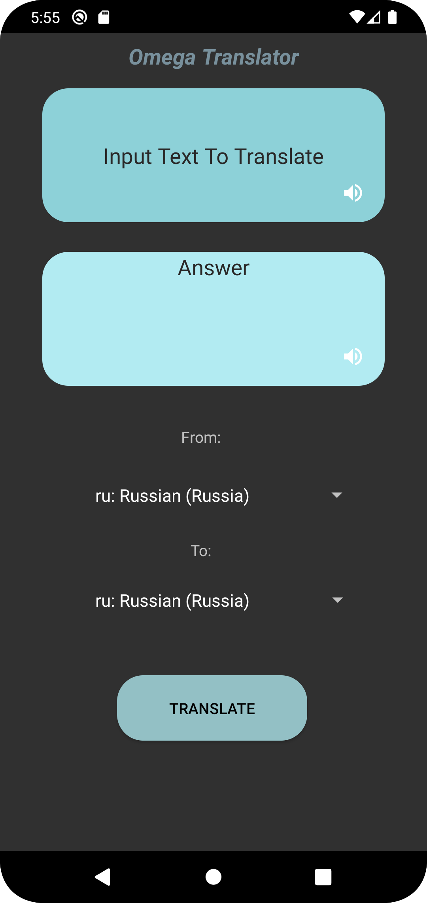

# Translator-App-Kotlin
Translator App is a Kotlin-based application that enables users to translate text from one language to another with ease. This app is designed with simplicity in mind, making it easy for users to quickly translate text without having to navigate through complex menus or settings. The app supports multiple languages, allowing users to translate between any two languages they desire. With its intuitive and user-friendly interface, Translator App is the perfect tool for individuals who need to communicate with people who speak different languages. Whether you're traveling abroad or working with international colleagues, Translator App has got you covered. Download the app now and start bridging language barriers!

## **Features**
+ Supports multiple languages for translation
+ User-friendly interface
+ High accuracy in translations
+ Utilizes an API for translations
+ Text To Speach Image Buttons to Convert text to voice using (https://developer.android.com/reference/android/speech/tts/TextToSpeech)

## **Getting Started**
To use this application, you need to install the APK file on your mobile or clone the repository and open it in Android Studio. You will also need to have an API key from mymemory.translated.net to perform the translations.

## **Usage**
To translate text, simply input the source language , target language and the text you want to translate, The application will perform the translation and display the results in the designated area, Moreover you can click on the Speaker Buttons to listen how to spell the words correctly.

## **Contribution**
If you would like to contribute to this project, you are welcome to submit a pull request. The project is open source and welcomes any contributions that can improve the user experience or add new features.

## **Author**
Abedalrahman Rasem (alonbe44@gmail.com)

## **License**
This project is licensed under the MIT License. Feel free to use and modify the code as you see fit.

## **Screenshots**

