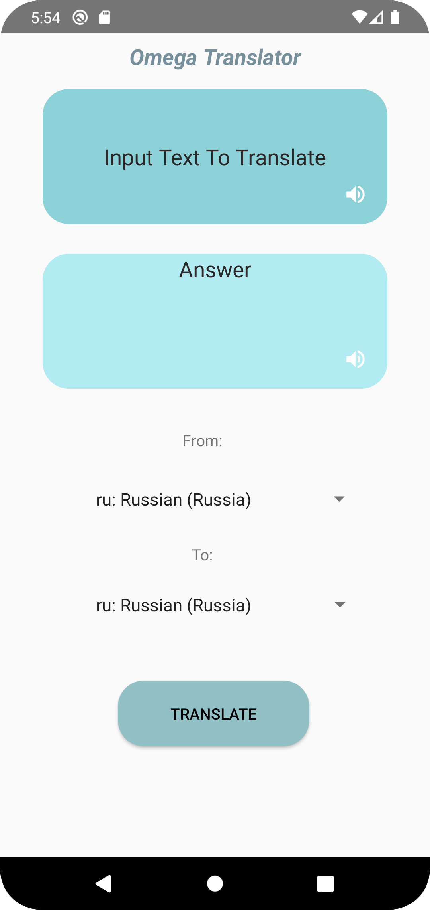

# -Translator-App-Kotlin
Translator App is a Kotlin-based application that enables users to translate text from one language to another with ease. This app is designed with simplicity in mind, making it easy for users to quickly translate text without having to navigate through complex menus or settings. The app supports multiple languages, allowing users to translate between any two languages they desire. With its intuitive and user-friendly interface, Translator App is the perfect tool for individuals who need to communicate with people who speak different languages. Whether you're traveling abroad or working with international colleagues, Translator App has got you covered. Download the app now and start bridging language barriers!

#Screenshots:

